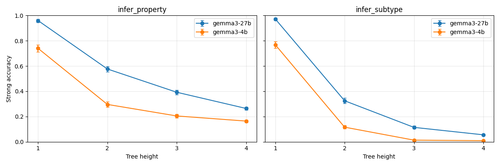
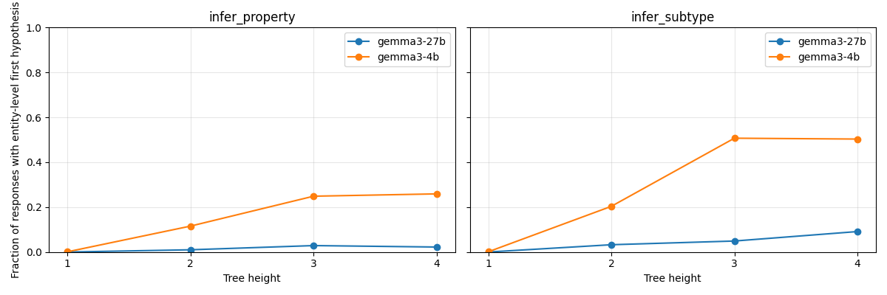
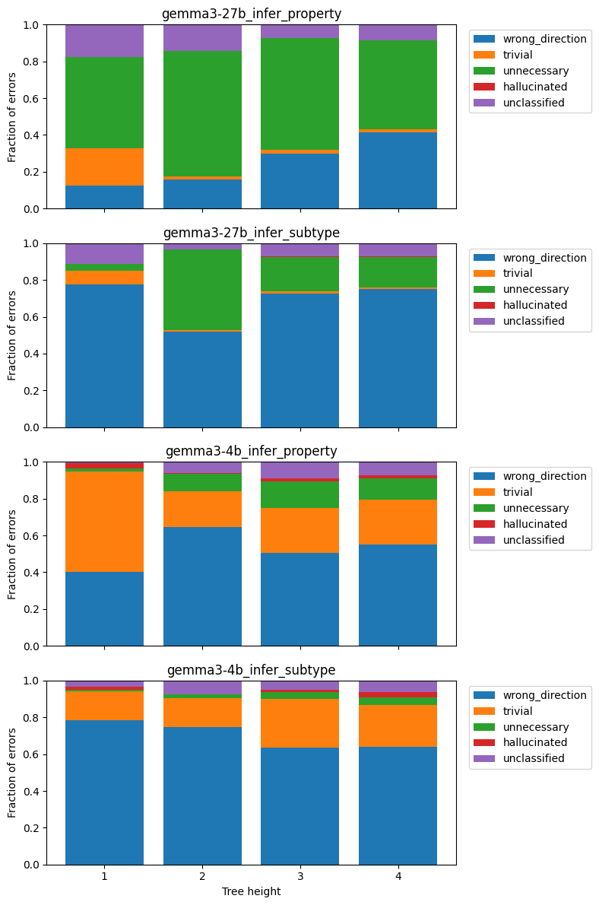

# Behavioral Results (Stage 1 draft)

Draft text for the project's final report. Numbers pulled from
`results/full/with_errortype/`; figures in
`docs/figures/full_with_errortype/`. Revise in the final report for voice
and length — this is first-pass content.

## Dataset and experimental setup

We generated 44,000 InAbHyD single-hypothesis examples following Sun &
Saparov v2, stratified as 1,000 / 2,000 / 3,000 / 5,000 examples at tree
heights 1 through 4, for each of two tasks (`infer_property`,
`infer_subtype`) and each of two models (Gemma 3 4B-IT, Gemma 3 27B-IT). We
held generation settings fixed at `Difficulty.SINGLE`, `mix_hops=False`,
uniform 2/3 branching, with deterministic per-cell seeds pinned in
`src.config.SHIPPED_SEEDS`. Inference ran against single-GPU vLLM
deployments on Modal, at `temperature=0`; for Gemma the system and user
messages were concatenated into a single user turn because Gemma's chat
template lacks a `system` role. We scored each response with the upstream
v2 pipeline (strong accuracy with `first_only=True`) after extending the
parser to canonicalize three Gemma-3-specific rephrasings
(`"Being X implies being Y"`, `"Being X is a property of being Y"`,
`"X is (not) a property of Y"`) and to recognize model hedging
disjunctions (`"X is Y or X is not Y"`) as explicit non-answers.

## Accuracy vs depth

On `infer_property`, Gemma 3 27B achieves 96.0% / 57.7% / 39.2% / 26.4%
strong accuracy at heights 1-4; Gemma 3 4B achieves 74.0% / 29.6% / 20.5%
/ 16.4%. On `infer_subtype`, 27B reaches 97.3% / 32.5% / 11.4% / 5.5% and
4B reaches 76.9% / 11.6% / 1.3% / 0.9%. The accuracy curves decrease
monotonically with depth for both models on both tasks, and 27B beats 4B
at every cell. The plan's Phase 1 exit criterion — 27B infer_property at
h=1 and h=2 within ±10 percentage points of the paper's Figure 3 values
(approximately 90% and 50% respectively) — is satisfied (+6pp at h=1,
+8pp at h=2). At deeper heights (h=3, h=4) our 27B strong accuracy runs
higher than paper Figure 3 estimates by 17pp and 21pp respectively; we
attribute this to serving-stack differences (bfloat16 / enforce-eager vLLM
on Modal H100) and treat it as a beneficial difference for probe training
since it yields more positive examples at the hard depths.

Positive counts meet the plan's ≥100-per-cell threshold at every cell
except `(4b, infer_subtype, h=3)` with 40 positives and
`(4b, infer_subtype, h=4)` with 45 positives. Probe analyses on those two
cells should carry wider confidence intervals or be aggregated with h=2.

## Structural properties of the dataset

After fixing an upstream `normalize_to_singular` bug that stemmed four
proper nouns (Thomas, Charles, James, Nicholas), every structural feature
we computed is a deterministic function of height across all 44,000 rows:

| feature                         | h=1 | h=2 | h=3 | h=4 |
|---------------------------------|-----|-----|-----|-----|
| `has_direct_member`             | 100%| 100%| 100%| 100%|
| `num_direct_paths`              | 3   | 1   | 1   | 1   |
| max non-direct proof depth      | 0   | 2   | 3   | 4   |
| target-concept branching factor | 3   | 4   | 4   | 4   |
| `parent_salience` (modal value) | 3   | 4   | 4   | 4   |

Only `parent_salience` shows any within-cell variance, and even there
4,984 of 5,000 rows at h=4 hit the modal value. **This has a direct
consequence for phantom-vs-real analysis.** The plan's Phase 4.2
structural slice — comparing accuracy on `has_direct_member=True` vs
`False` — is vacuous on this dataset because the `False` slice is empty.
More importantly, the Ma et al. concern that SAE "reasoning features"
actually detect shortcut *availability* (rather than shortcut *usage*)
cannot manifest on this dataset at the data level: there is no varying
shortcut to detect. This rules out one specific interpretation of the
phantom concern without requiring a behavioral ablation, though it
leaves intact the concerns about shortcut *usage* and about probes
detecting surface-level lexical cues that correlate with depth.

## Output strategy divergence between models

We classify each model response by whether its first parsed hypothesis is
entity-level (e.g., `"Jerry is not muffled"` — a restatement of an
observation) or concept-level (e.g., `"Dalpists are not muffled"` — a
generalization). The two models diverge sharply as depth increases:

| cell                   | h=1 | h=2  | h=3  | h=4  |
|------------------------|-----|------|------|------|
| 4b × infer_property entity frac | 0.1% | 10.9%| 23.8%| 24.9%|
| 27b × infer_property entity frac| 0.0% | 1.1% | 2.7% | 2.1% |
| 4b × infer_subtype  entity frac | 0.1% | 19.1%| 48.2%| 48.1%|
| 27b × infer_subtype entity frac | 0.0% | 3.1% | 4.6% | 8.8% |

The 4B model falls back to entity-level enumeration nearly half the time
on `infer_subtype` at h≥3, whereas 27B stays concept-level >90% of the
time across all cells. This is broadly consistent with prior observations
on Gemma 3 12B and suggests that generalization depth is not just a
function of accuracy but of whether the model attempts the generalization
at all. For downstream probe analysis, this means the 4B failure
distribution is structured qualitatively differently from the 27B
distribution — a probe trained to predict failure from pre-CoT activations
may be detecting strategy-choice rather than reasoning-depth features,
especially on the 4B model. Cross-model probe transfer is a natural
diagnostic.

## Error type distribution

We classified 33,294 incorrect responses into the four-category taxonomy
from Sun & Saparov v2 Appendix H.1 using `gpt-5.4-mini` as the judge
(after a stage-1 nano-vs-mini agreement check yielded 57.5%, below the
plan's 85% threshold for remaining at the cheaper nano tier). Top-2
dominant categories per cell:

| model / task             | h=1                 | h=2                 | h=3                 | h=4                 |
|--------------------------|---------------------|---------------------|---------------------|---------------------|
| 27b × infer_property     | unnecessary 51%     | unnecessary 68%     | unnecessary 61%     | unnecessary 48%     |
| 27b × infer_subtype      | wrong_direction 78% | wrong_direction 52% | wrong_direction 73% | wrong_direction 75% |
| 4b × infer_property      | trivial 54%         | wrong_direction 65% | wrong_direction 51% | wrong_direction 55% |
| 4b × infer_subtype       | wrong_direction 78% | wrong_direction 75% | wrong_direction 64% | wrong_direction 64% |

Two qualitative findings:

1. **27B × infer_property matches the paper's headline finding** that
   "unnecessary hypotheses" (Error Type 2) dominate — the model knows the
   correct generalization but redundantly also names subtypes and
   entity-level specializations.
2. **All `infer_subtype` cells are dominated by `wrong_direction`.** The
   model identifies which concepts are related but reverses the subtype
   direction (e.g., GT `Every worple is a gergit`; prediction
   `Every gergit is a worple`). This is consistent with the surface-form
   ambiguity in observations of the form `"X is a Y"`, where `X` and `Y`
   are both concepts and the direction of the implied subtype relation
   is not fully constrained by the prompt. For subtype probes, this
   suggests a useful additional label: does the model's output get the
   *extension* right but the *direction* wrong, or does it miss the
   extension entirely?

The plan's §5.5 follow-up analysis — whether error type correlates with
`has_direct_member` — collapses because the `has_direct_member=False`
slice is empty (see Structural properties above).

## Caveats

- **Parse failure rate above plan target on 27B `infer_property` at
  h≥2.** Rates are 9.6% / 8.8% / 10.4% at h=2 / h=3 / h=4, above the
  plan's 5% target. Inspection shows the residuals are overwhelmingly
  Gemma 3 hedging disjunctions — the model emits `"X is Y or X is not Y"`
  chains for every concept in the ontology instead of picking one. These
  are genuine "I don't know" answers and `src/gemma3_parse.py::_hedged()`
  correctly drops them rather than parsing an arbitrary half. We accept
  this as a property of the model, not a parser gap, and leave the
  `parse_failed` flag so Teammate B can choose whether to train probes
  on those rows.
- **Shipped dataset is authoritative; regeneration is seed-equivalent
  but not byte-identical.** Upstream `Ontology.__init__` has residual
  set-iteration non-determinism that is independent of the RNG seed, so
  re-running `python -m src.generate_examples` produces statistically
  equivalent but not string-identical examples (e.g., `"Every X is Y"`
  may come out as `"Each X is Y"`). The pickles in `data/full/` are the
  authoritative source.

## Implications for Components 2 and 3

Four concrete things Stage 1 results imply for the probe and causal
validation work downstream:

1. The "shortcut-availability" interpretation of the Ma et al. phantom
   concern is ruled out by construction. Probe analyses should state
   this explicitly and focus on the remaining phantom interpretations
   (shortcut *usage*, surface-lexical features).
2. **Cross-task probe transfer (`infer_property` ↔ `infer_subtype`) is
   the cleanest experiment the dataset structure enables** and should be
   on Teammate B's shortlist. The two tasks share the same ontology-tree
   generation (identical theories/observations schema, identical
   structural invariants at each height) but differ in the surface form
   of the ground truth hypothesis (`"Every X is Y"` where Y is a
   property vs Y is a concept). A failure-prediction probe trained on
   `infer_property` pre-CoT activations that transfers cleanly to
   `infer_subtype` cannot be detecting task-specific lexical cues —
   which is a direct behavioral test of the phantom surface-feature
   concern. Conversely, a probe that fails to transfer suggests the
   learned representation is task-surface-bound, which is the
   Ma et al. failure mode.
3. Cross-model probe transfer (4B ↔ 27B) is a complementary diagnostic.
   The 4B vs 27B output-strategy divergence means a probe that
   transfers across models cannot be relying on model-specific strategy
   signals (e.g., "this model tends to fall back to entity-level
   enumeration at depth ≥3").
4. The dominant 27B × property error mode is "unnecessary hypotheses"
   and the dominant subtype error mode is `wrong_direction`. Targeted
   steering probes — e.g., can we cause 27B to produce a concept-level
   generalization on examples it would otherwise hedge on? — should
   probably be scoped to these dominant failure modes rather than
   undifferentiated "failure".
